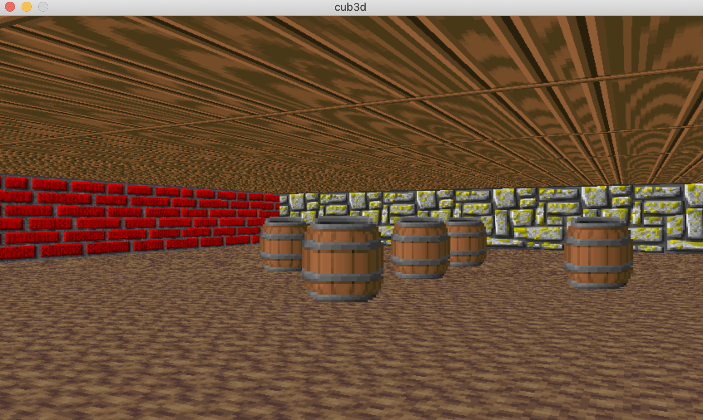

# cub3D
105/100

# Introduction

Create a “realistic” 3D graphical
representation of the inside of a maze from a
first person perspective. You have to create this
representation using the Ray-Casting.

# Mandatory part

External functions allowed: open, close, read, write, malloc, free perror, strerror, exit. MinilibX and math.h functions.

# Usage

## Version for macOS:

1. Install minilibX: *./mlx_install.sh*
1. *make*
1. *./cub3D maps/map3.cub*

